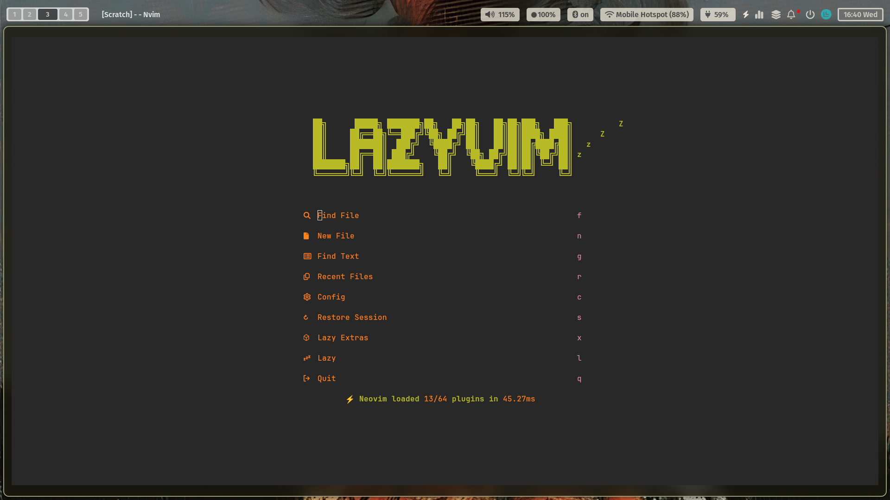
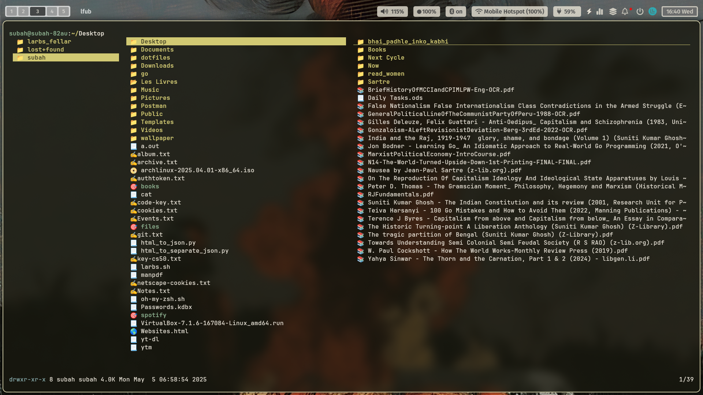
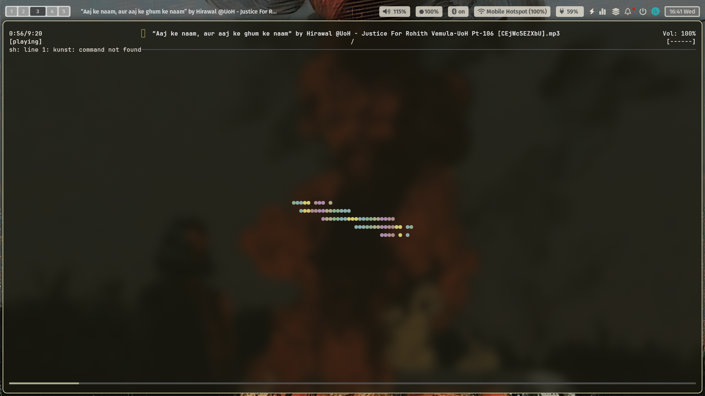
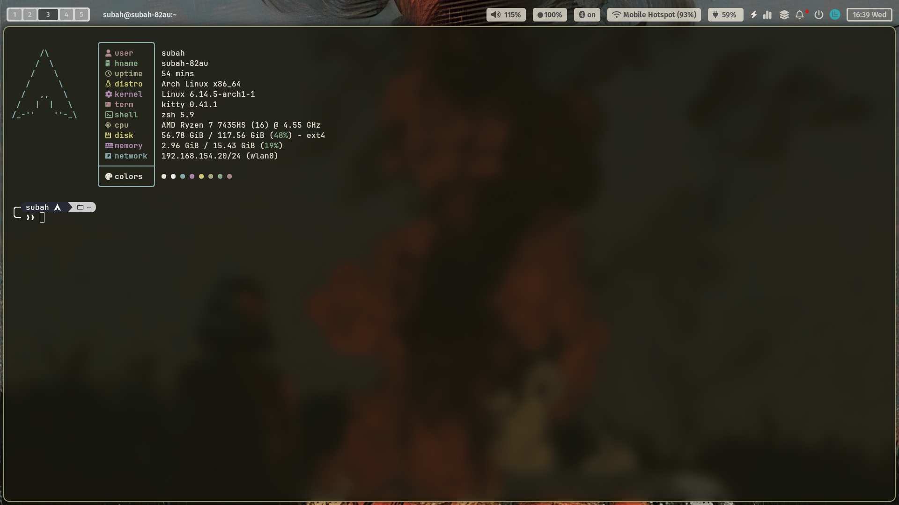
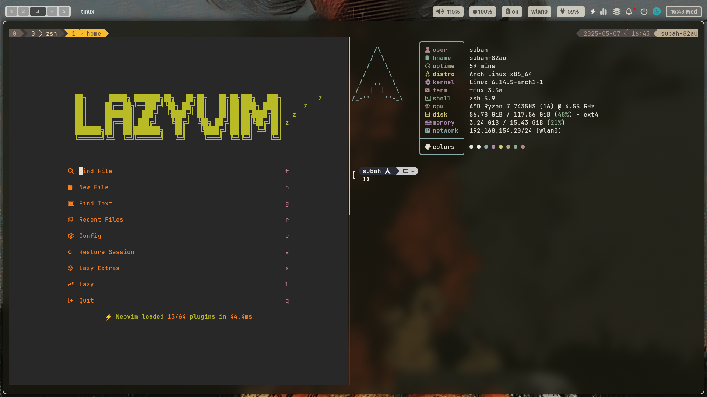
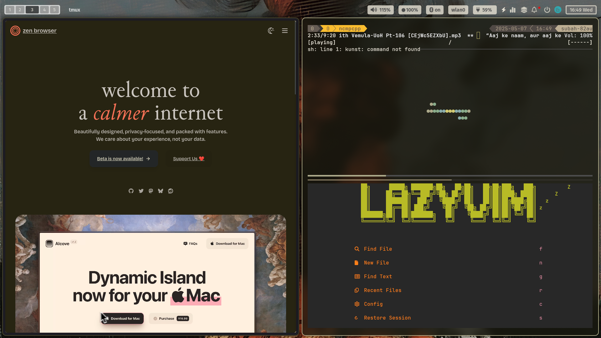

# Dotfiles

### managed with GNU stow

## hyprland - ml4w

### 1. nvim

- LazyVim
- Gruvbox - dark
- complete lsp and cmp config for ts and go projects
- codeium disabled

### 2. lf

- ueberzugpp for wayland

### 3. mpd

### 4. ncmpcpp

### 5. zshrc

- aliases + vim mode + autocmp + colors

### 6. kitty

- default with opacity
- custom config for tabs and windows

### 7. tmux

- custom config

---

#### ML4W customised

### 8. hypr

- custom keybinds

### 9. waybar

- custom modern light

### 10. ml4w

- change screenshot folder

### 11. nwg-dock-hyprland

- no exclusive space + autohide

### 12. wlogout

- custom hover-bg
